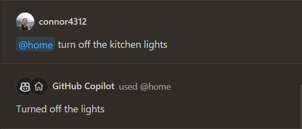

# VS Code Home Assistant Chat

This is an extension that allows you to chat with your Home Assistant as an agent in VS Code's chat. It uses the Assist functions of [Home Assistant](https://www.home-assistant.io/voice_control/), specifically their Conversation integration which can be [configured](https://www.home-assistant.io/integrations/conversation/).

